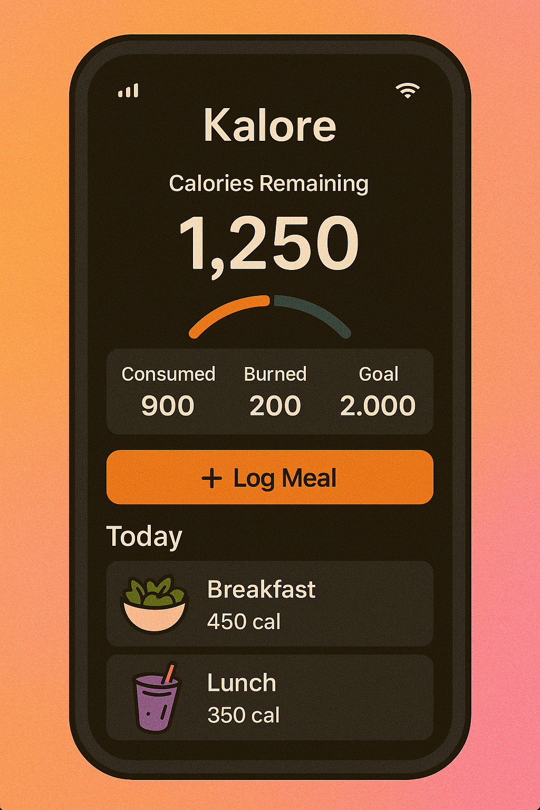
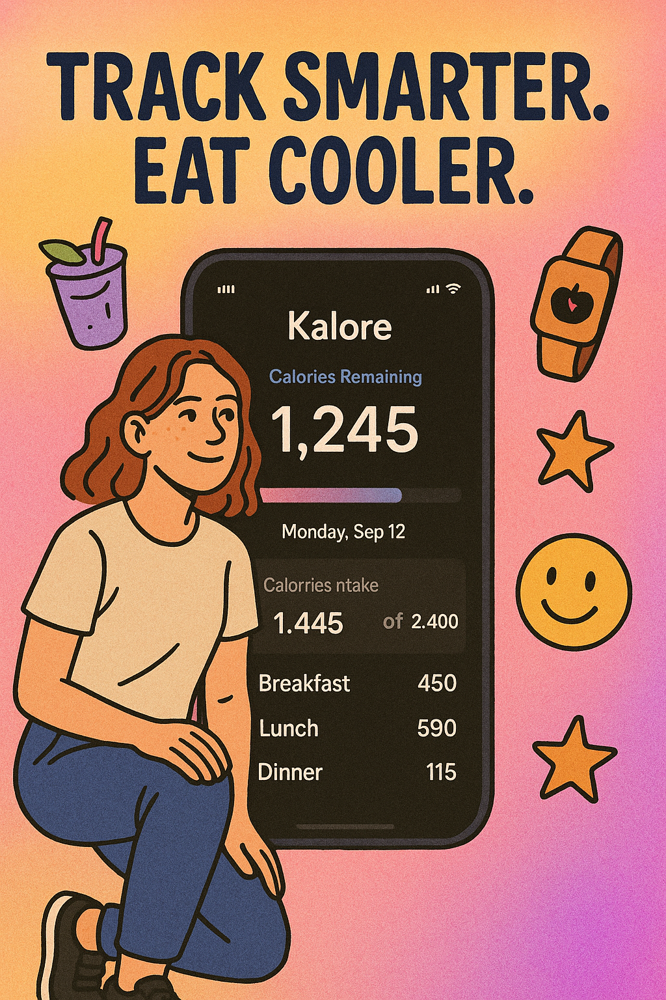

import GithubCard from '@/components/GithubCard.astro'

## Meet Kalore 🍓

We all want to feel good in our own skin. But calorie tracking apps often feel like spreadsheets with guilt trips. So we created **Kalore** — a web app that helps you understand your eating habits with clarity, not pressure.

Designed to be simple, beautiful, and a little playful, Kalore helps users build a healthier relationship with food — one day at a time.

## Why Kalore?

Food is more than numbers. It's memories, comfort, energy, celebration — and yes, sometimes it's also just snacks at midnight.

But we also know that tracking what we eat can help us feel more in control and aware. Kalore is here to **remove the stress**, **ditch the perfection**, and help you **tune into your body’s needs** — with a soft, supportive tone.

## Tech Behind the Scenes 🛠️

- **Vite**: For lightning-fast development and smooth builds.
- **React + TypeScript**: A modern, scalable framework for building UI that feels effortless.
- **TailwindCSS**: Used for a lightweight, clean, and mobile-first design.
- **Firebase**: Auth and real-time storage, so your data is always where you left it.
- **Netlify**: For seamless deployment and performance.

## What Can You Do with Kalore?

✨ Here’s what makes Kalore unique:

- **Quick Log, No Judgment**: Add your meals with a tap. No calorie-bomb alarms. Just gentle awareness.
- **Visual Diary**: See your food intake as a story — not a score.
- **Smart Reminders**: Nudges to stay hydrated, eat regularly, and check in (not obsess).
- **Goals, Your Way**: Set what *you* care about — whether it’s weight, energy levels, or just balance.
- **Privacy First**: Your data stays yours. No ads, no creepy targeting.

## Design Challenge: Keep it Real

Making Kalore feel more like a **friend** and less like a **fitness coach** was a key design goal.

We focused on **warm visuals**, **simple flows**, and **encouraging micro-interactions**. We also resisted the urge to over-analyze. Because sometimes you just need to eat the cake. 🍰

{/* ## Peek Inside 💡 */}
{/* 

  
  
  

 */}

## Explore the Code

  <GithubCard owner='lynntheophene' repository='kalore' />

## Final Thoughts 💬

Kalore is more than a tracker — it’s a quiet little companion to help you eat with more joy and awareness. Whether you’re meal-prepping or just trying to drink more water, Kalore has your back.

Take it for a spin, and discover how *tracking your food can actually feel good*.

---

**Made with love, matcha, and a little too much peanut butter. 💚**
